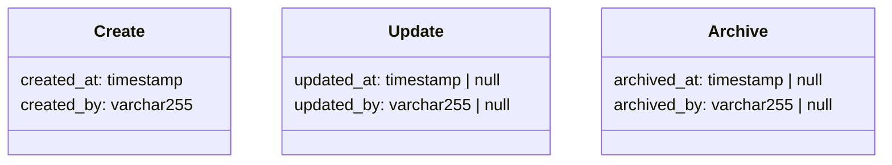
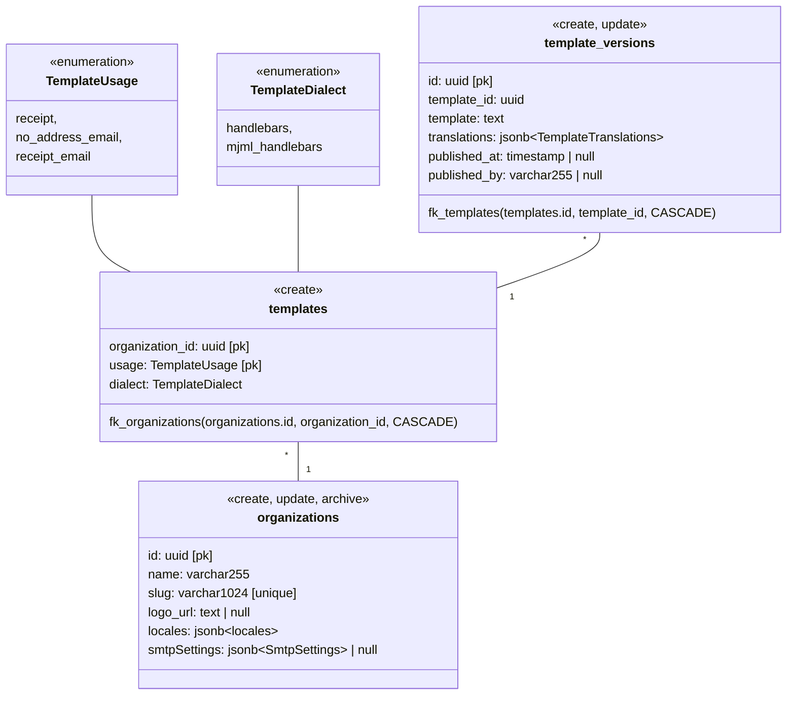
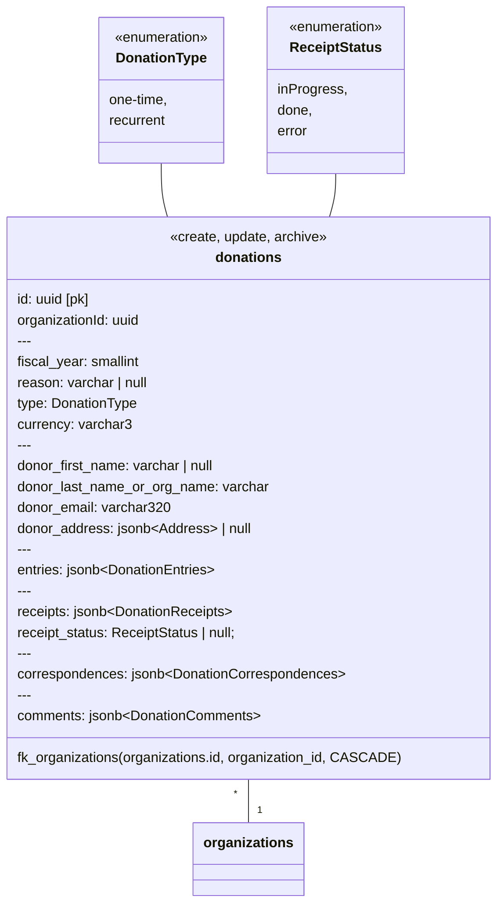

# Database diagram

The database schema is described below. Every table is represented by a class in the class diagrams.

## 🐾 Tracing

Tracing fields can be appended to database entities. Those traces add the described fields on the attached entity.



## 🔐 Organizations, Templates & Settings

Organizations are the primary entity of the system. Donations, templates and other settings are attached to them.

Templates allow organizations to customize the content of the generated artifacts (receipts and emails) so it matches their branding.



### JSON objects

```typescript
type Locales {
  locales: string[]
}

type SmtpSettings {
  host: string
  port: number
  secure: boolean
  username: string
  password: string  // Must be encrypted (use AES-256)
  from: string | null
  replyTo: string | null
}

type LocalizedString = Record<string, string>

type TemplateTranslations = Record<string, LocalizedString>
```

## 💵 Donations

Donations record the action of a donor who gives money. Donations come in two modes: one-time donations and recurring donations.

One-time donations record the donation and produce the receipts immediately after.

Recurring donations record donations made throughout the year. Only once the fiscal year is closed are all receipts produced and sent.



### JSON Objects

```typescript
type Address = {
  line1: string;
  line2: string | null;
  city: string;
  postalCode: string;
  state: string | null;
  country: string;
};

// DonationEntries
enum DonationSource {
  paypal,
  check,
  directDeposit,
  stocks,
  other,
}

type DonationEntry = {
  id: string;
  fractionalAmount: number;
  fractionalReceiptAmount: number;

  receivedAt: Date;

  source: DonationSource;
  sourceDetails: PaypalPayment | null;
} & CreateEntity &
  ArchiveEntity;

type DonationEntries = {
  entries: DonationEntry[];
};

// Receipts
enum ReceiptType = {
  original,
  revised,
}

type Receipt = {
  id: string;
  type: ReceiptType;

  fileUri: string | null;
} & CreateEntity & ArchiveEntity;

type DonationReceipts = {
  receipts: Receipt[]
}

// Correspondences
enum CorrespondenceStatus = {
  inProgress,
  done,
  error,
}

enum CorrespondenceType = {
  noAddressReminder,
  receipt,
}

type Correspondence = {
  id: string;
  type: CorrespondenceType;
  status: CorrespondenceStatus;

  sentTo: string;
  sentAt: Date;

  attachedDocumentIds: string[];

} & CreateEntity & ArchiveEntity;

type DonationCorrespondences = {
  correspondences: Correspondence[];
}

// Comments
type Comment = {
  comment: string;
} & CreateEntity & UpdateEntity & ArchiveEntity;

type DonationComments = {
  comments: Comment[];
}
```
