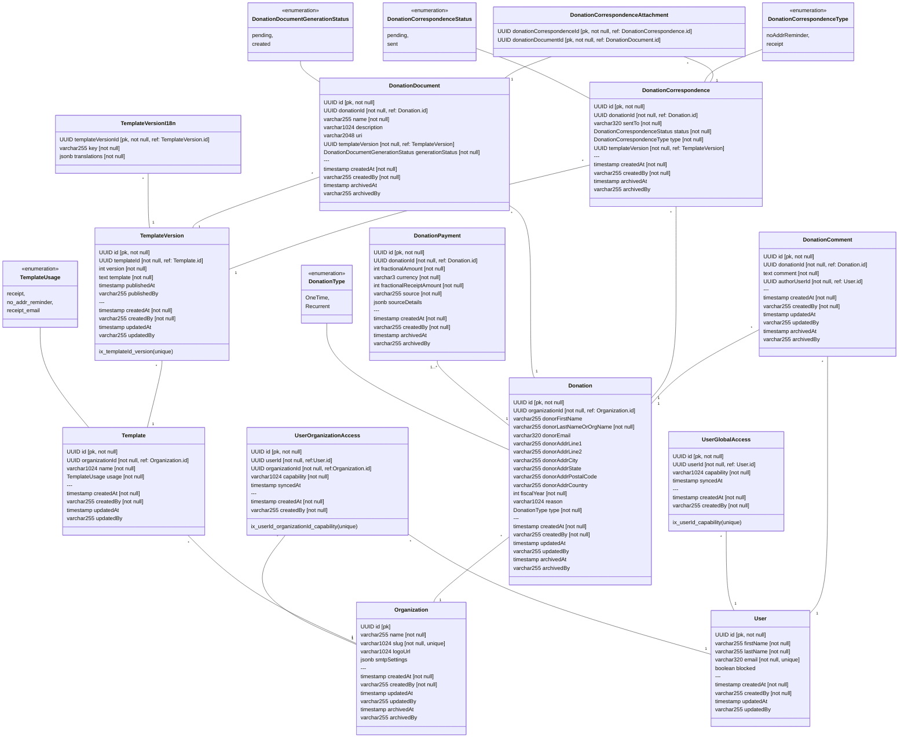

# Database diagram

```mermaid
  classDiagram

  class Organization {
    UUID id [pk]
    varchar255 name [not null]
    varchar1024 slug [not null, unique]
    varchar1024 logoUrl

    jsonb smtpSettings
    ---
    timestamp createdAt [not null]
    varchar255 createdBy [not null]
    timestamp updatedAt
    varchar255 updatedBy
    timestamp archivedAt
    varchar255 archivedBy
  }

  class User {
    UUID id [pk, not null]
    varchar255 firstName [not null]
    varchar255 lastName [not null]
    varchar320 email [not null, unique]
    boolean blocked
    ---
    timestamp createdAt [not null]
    varchar255 createdBy [not null]
    timestamp updatedAt
    varchar255 updatedBy
  }

  %% User access tables
  class UserOrganizationAccess {
    UUID id [pk, not null]
    UUID userId [not null, ref:User.id]
    UUID organizationId [not null, ref:Organization.id]
    varchar1024 capability [not null]

    timestamp syncedAt
    ---
    timestamp createdAt [not null]
    varchar255 createdBy [not null]

    ix_userId_organizationId_capability(unique)
  }

  UserOrganizationAccess "*" -- "1" User
  UserOrganizationAccess "*" -- "1" Organization

  class UserGlobalAccess {
    UUID id [pk, not null]
    UUID userId [not null, ref: User.id]
    varchar1024 capability [not null]

    timestamp syncedAt

    ---
    timestamp createdAt [not null]
    varchar255 createdBy [not null]

    ix_userId_capability(unique)
  }

  UserGlobalAccess "*" -- "1" User

  %% Organization settings / Templates
  class Template {
    UUID id [pk, not null]
    UUID organizationId [not null, ref: Organization.id]
    varchar1024 name [not null]
    TemplateUsage usage [not null]

    ---
    timestamp createdAt [not null]
    varchar255 createdBy [not null]
    timestamp updatedAt
    varchar255 updatedBy
  }

  class TemplateUsage {
    <<enumeration>>
    receipt,
    no_addr_reminder,
    receipt_email
  }

  TemplateUsage -- Template
  Template "*" -- "1" Organization

  class TemplateVersion {
    UUID id [pk, not null]
    UUID templateId [not null, ref: Template.id]
    int version [not null]

    text template [not null]

    timestamp publishedAt
    varchar255 publishedBy

    ---
    timestamp createdAt [not null]
    varchar255 createdBy [not null]
    timestamp updatedAt
    varchar255 updatedBy

    ix_templateId_version(unique)
  }

  TemplateVersion "*" -- "1" Template

  class TemplateVersionI18n {
    UUID templateVersionId [pk, not null, ref: TemplateVersion.id]

    varchar255 key [not null]
    jsonb translations [not null]
  }

  TemplateVersionI18n "*" -- "1" TemplateVersion

  %% Donations

  class Donation {
    UUID id [pk, not null]
    UUID organizationId [not null, ref: Organization.id]

    varchar255 donorFirstName
    varchar255 donorLastNameOrOrgName [not null]
    varchar320 donorEmail

    varchar255 donorAddrLine1
    varchar255 donorAddrLine2
    varchar255 donorAddrCity
    varchar255 donorAddrState
    varchar255 donorAddrPostalCode
    varchar255 donorAddrCountry

    int fiscalYear [not null]
    varchar1024 reason
    DonationType type [not null]

    ---
    timestamp createdAt [not null]
    varchar255 createdBy [not null]
    timestamp updatedAt
    varchar255 updatedBy
    timestamp archivedAt
    varchar255 archivedBy
  }

  Donation "*" -- "1" Organization

  class DonationType {
    <<enumeration>>
    OneTime,
    Recurrent
  }

  DonationType -- Donation

  class DonationPayment {
    UUID id [pk, not null]
    UUID donationId [not null, ref: Donation.id]
    int fractionalAmount [not null]
    varchar3 currency [not null]
    int fractionalReceiptAmount [not null]

    varchar255 source [not null]
    jsonb sourceDetails

    ---
    timestamp createdAt [not null]
    varchar255 createdBy [not null]
    timestamp archivedAt
    varchar255 archivedBy
  }

  DonationPayment "1...*" -- "1" Donation

  class DonationDocument {
    UUID id [pk, not null]
    UUID donationId [not null, ref: Donation.id]
    varchar255 name [not null]
    varchar1024 description
    varchar2048 uri

    UUID templateVersion [not null, ref: TemplateVersion]

    DonationDocumentGenerationStatus generationStatus [not null]

    ---
    timestamp createdAt [not null]
    varchar255 createdBy [not null]
    timestamp archivedAt
    varchar255 archivedBy
  }

  DonationDocument "*" -- "1" Donation
  DonationDocument "*" -- "1" TemplateVersion

  class DonationDocumentGenerationStatus {
    <<enumeration>>
    pending,
    created
  }

  DonationDocumentGenerationStatus -- DonationDocument

  class DonationCorrespondence {
    UUID id [pk, not null]
    UUID donationId [not null, ref: Donation.id]

    varchar320 sentTo [not null]
    DonationCorrespondenceStatus status [not null]
    DonationCorrespondenceType type [not null]

    UUID templateVersion [not null, ref: TemplateVersion]

    ---
    timestamp createdAt [not null]
    varchar255 createdBy [not null]
    timestamp archivedAt
    varchar255 archivedBy
  }

  DonationCorrespondence "*" -- "1" Donation
  DonationCorrespondence "*" -- "1" TemplateVersion

  class DonationCorrespondenceStatus {
    <<enumeration>>
    pending,
    sent
  }

  DonationCorrespondenceStatus -- DonationCorrespondence

  class DonationCorrespondenceType {
    <<enumeration>>
    noAddrReminder,
    receipt
  }

  DonationCorrespondenceType -- DonationCorrespondence

  class DonationCorrespondenceAttachment {
    UUID donationCorrespondenceId [pk, not null, ref: DonationCorrespondence.id]
    UUID donationDocumentId [pk, not null, ref: DonationDocument.id]
  }

  DonationCorrespondenceAttachment "*" -- "1" DonationCorrespondence
  DonationCorrespondenceAttachment "*" -- "1" DonationDocument

  class DonationComment {
    UUID id [pk, not null]
    UUID donationId [not null, ref: Donation.id]

    text comment [not null]

    UUID authorUserId [not null, ref: User.id]

    ---
    timestamp createdAt [not null]
    varchar255 createdBy [not null]
    timestamp updatedAt
    varchar255 updatedBy
    timestamp archivedAt
    varchar255 archivedBy
  }

  DonationComment "*" -- "1" Donation
  DonationComment "*" -- "1" User
```
